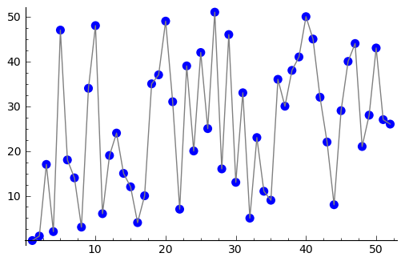

    
    

# DiscreteLog.jl

A work-in-progress julia package to implement the degree 3-to-2 and 
degree 4-to-3 procedures from:

https://eprint.iacr.org/2019/751.pdf

In addition, in the vein of [Hecke.jl](https://github.com/thofma/Hecke.jl), 
this aims to implement general as well as finite field 
elliptic curve projective and affine point arithmetic, as well as 
abstract types for divisors on elliptic curves up to linear equivalence (e.g. 
divisors associated to rational functions on the curve et al.), as well as 
for models of elliptic curves with a specific divisor and points on them of a 
fixed degree.

A future goal is to broaden the scope of the library to be a comprehensive 
collection of recent efficient algorithms for group law computations of points
for elliptic curves (genus `g = 1`) as well as hyperelliptic curves (genus `g = 2`)
and for their Jacobians.

## Dependencies
[AbstractAlgebra.jl](https://github.com/wbhart/AbstractAlgebra.jl)
